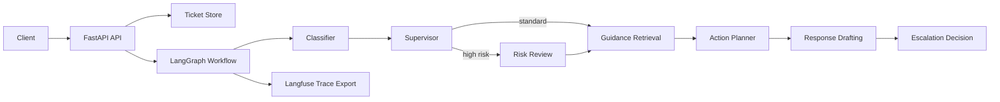

# Multi-Agent Support Triage API

Production-style FastAPI service demonstrating multi-agent LLM orchestration with LangGraph,
Pydantic contracts, LangChain prompt composition, optional AWS Bedrock support, and Langfuse tracing.

The demo takes an incoming support ticket and routes it through a small agent workflow:

1. Classifier agent identifies category and priority.
2. Supervisor agent decides whether risk review is required.
3. Risk review agent adds controls for high-impact cases.
4. Retrieval agent pulls local support guidance.
5. Planner agent creates recommended next actions.
6. Drafting agent prepares a customer-facing response.
7. Escalation agent decides whether the ticket should be escalated.

## Why This Exists

This repository is designed as a compact portfolio project for production AI engineering roles. It
shows how to expose a multi-agent workflow through an API while keeping the app testable, observable,
and runnable without cloud credentials.

## Production Engineering Signals

- Versioned API routes under `/api/v1`
- Strict Pydantic request models with bounded input sizes
- Idempotent triage endpoint with an explicit `force=true` override
- Thread-safe in-memory repository for local/demo execution
- Request ID middleware for traceability across API calls
- Deterministic mock LLM for tests and CI
- Optional Bedrock provider abstraction for real LLM calls
- Optional Langfuse export with trace/session/user metadata

## Architecture



## Tech Stack

- Python 3.11+
- FastAPI
- Pydantic
- LangGraph
- LangChain Core
- Langfuse
- Optional AWS Bedrock via `langchain-aws`
- Pytest and Ruff

## Project Structure

```text
app/
  agents/       LangGraph state, nodes, and compiled workflow
  core/         settings and logging
  models/       Pydantic request/response models
  services/     LLM provider, knowledge base, tracing, and ticket store
  api.py        FastAPI routes
  main.py       FastAPI application entrypoint
tests/          API and graph tests
```

## Run Locally

```bash
python3 -m venv .venv
source .venv/bin/activate
make install
cp .env.example .env
make dev
```

Open the API docs at [http://localhost:8000/docs](http://localhost:8000/docs).

## Example Request

Create a ticket:

```bash
curl -X POST http://localhost:8000/api/v1/tickets \
  -H "Content-Type: application/json" \
  -d '{
    "customer_id": "cust_123",
    "subject": "Cannot access account before payroll",
    "description": "I am locked out after MFA setup and payroll closes today.",
    "channel": "email"
  }'
```

Run triage:

```bash
curl -X POST http://localhost:8000/api/v1/tickets/{ticket_id}/triage
```

Example response shape:

```json
{
  "status": "triaged",
  "report": {
    "category": "account",
    "priority": "high",
    "confidence": 0.78,
    "recommended_actions": [
      "Route to a senior support owner for same-day review.",
      "Verify identity before changing account access.",
      "Respond using the high priority support SLA."
    ],
    "escalate": true,
    "workflow_path": ["classifier", "supervisor", "risk_review", "retrieval", "planner", "drafting", "escalation"]
  }
}
```

## Configuration

The default `LLM_PROVIDER=mock` gives deterministic responses and needs no API keys.

To use AWS Bedrock:

```bash
python3 -m pip install -e ".[bedrock]"
```

Then set:

```env
LLM_PROVIDER=bedrock
AWS_REGION=eu-west-2
BEDROCK_MODEL_ID=anthropic.claude-3-5-sonnet-20240620-v1:0
```

To enable Langfuse tracing, configure:

```env
LANGFUSE_ENABLED=true
LANGFUSE_PUBLIC_KEY=...
LANGFUSE_SECRET_KEY=...
LANGFUSE_HOST=https://cloud.langfuse.com
```

## Quality Checks

```bash
make lint
make test
```

## Docker

```bash
cp .env.example .env
docker compose up --build
```
